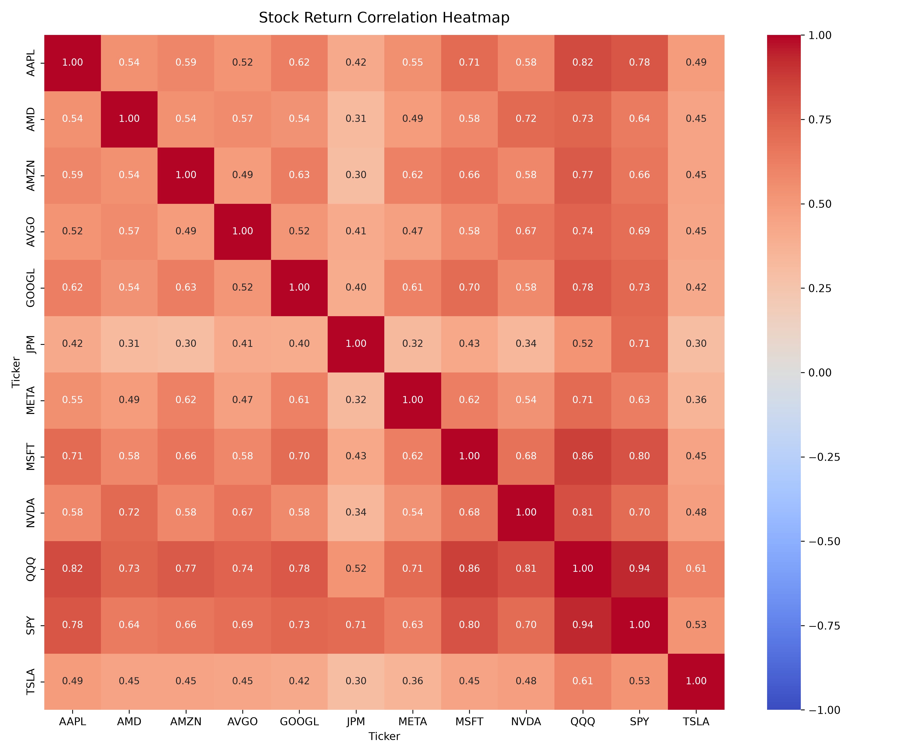

# PYTHON-MARCO: Quant & Development Sandbox

Raccolta di script in Python, analisi di dati finanziari e prototipi di ricerca orientati alla modellizzazione stocastica e all'analisi dei mercati finanziari.

## Struttura della Repository
- `src/` o file principali: Script di analisi e visualizzazione dati (es. `stock_heatmap.py`).
- Sviluppato per testare librerie di calcolo numerico e visualizzazione (`pandas`, `numpy`, `matplotlib`).
### Anteprima Heatmap

## Obiettivo
Costruire una base solida di codice pulito, modulare e orientato alla finanza quantitativa in vista di progetti di ricerca accademica avanzata.
